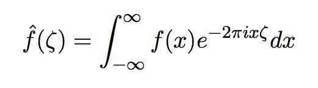

*Due Thursday, 08 October, 1:00 PM*

50 points total.

$5^{n=day}$ points taken off for each day late.

This assigment includes turning in the first two assignments. All three should
include knitr files (named `homework1.rmd`, `homework2.rmd`, `homework3.rmd`)
along with valid PDF output files. Inside each file, clearly indicate which
parts of your responses go with which problems (you may use the original homework
document as a template). Add your name as `author` to the file's metadata section.
Raw R code/output or word processor files are not acceptable.

Failure to properly name files or include author name may result in 5 points taken off.

### Question 1 ###

**10 points**

1. Use GitHub to turn in the first three homework assignments. Make sure the teacher (couthcommander) and TA (trippcm) are collaborators. (5 points)

1. Commit each assignment individually.  This means your repository should have at least three commits. (5 points)

Please see my GitHub repsitory for details.

### Question 2 ###

**15 points**

Write a simulation to calculate the power for the following study
design.  The study has two variables, treatment group and outcome.
There are two treatment groups (0, 1) and they should be assigned
randomly with equal probability.  The outcome should be a random normal
variable with a mean of 60 and standard deviation of 20.  If a patient
is in the treatment group, add 5 to the outcome.  5 is the true
treatment effect.  Create a linear of model for the outcome by the
treatment group, and extract the p-value (hint: see assigment1).
Test if the p-value is less than or equal to the alpha level, which
should be set to 0.05.

Repeat this procedure 1000 times. The power is calculated by finding
the percentage of times the p-value is less than or equal to the alpha
level.  Use the `set.seed` command so that the professor can reproduce
your results.

1. Find the power when the sample size is 100 patients. (10 points)

1. Find the power when the sample size is 1000 patients. (5 points)

```{r}
##step 1
alpha <- 0.05
sample <- 100
times <- 1000
count <- 0
for(i in 1:times){
    set.seed(i)
    group <- c(rbinom(sample, 1, 0.5))
    outcome <- c(rnorm(sample, 60, 20))
    x <- data.frame(group, outcome)
    for(j in 1:sample){
        if(x[j,1] == 1){
            x[j,2] = x[j,2] + 5
        }
    }
    mod <- lm(outcome ~ group, dat=x)
    mod.c <- coef(summary(mod))
    p <- 2*pt(mod.c[2,3], df = 98, lower.tail = FALSE)
    if(p <= alpha){
        count = count + 1
    }   
}
power100 <- count/times
print(paste0("the power when the sample size is 100 patients: ", power100))

#############

##step 2
alpha <- 0.05
sample <- 1000
times <- 1000
count <- 0
for(i in 1:times){
    set.seed(i)
    group <- c(rbinom(sample, 1, 0.5))
    outcome <- c(rnorm(sample, 60, 20))
    x <- data.frame(group, outcome)
    for(j in 1:sample){
        if(x[j,1] == 1){
            x[j,2] = x[j,2] + 5
        }
    }
    mod <- lm(outcome ~ group, dat=x)
    mod.c <- coef(summary(mod))
    p <- 2*pt(mod.c[2,3], df = 998, lower.tail = FALSE)
    if(p <= alpha){
        count = count + 1
    }   
}
power1000 <- count/times
print(paste0("the power when the sample size is 1000 patients: ", power1000))
```

The above is the R code. We can see that power increases significantly when we increase sample size from 100 to 1000.

### Question 3 ###

**15 points**

Obtain a copy of the [football-values lecture](https://github.com/couthcommander/football-values).
Save the `2015/proj_rb15.csv` file in your working directory.  Read
in the data set and remove the first two columns.

1. Show the correlation matrix of this data set. (3 points)

1. Generate a data set with 30 rows that has a similar correlation
structure.  Repeat the procedure 10,000 times and return the mean
correlation matrix. (10 points)

1. Generate a data set with 30 rows that has the exact correlation
structure as the original data set. (2 points)

```{r}
library(RCurl)
my_url<-"https://raw.githubusercontent.com/couthcommander/football-values/master/2015/proj_rb15.csv"
download.file(my_url, destfile="football.csv",method="curl")
football=read.csv("football.csv")
football <- football[,-(1:2)]
##step 1
corr <- cor(football)
corr

##step 2
library(MASS)
times <- 10000
corr2 <- matrix(data = 0, nrow = 8, ncol = 8, byrow = FALSE)
for(i in 1:times){
    mean <- rep(0, 8)
    for(i in 1:8){
        mean[i] = mean(football[,i])
    }  
    r2 <- mvrnorm(n = 30, mean, corr, tol = 1e-6, empirical = FALSE, EISPACK = FALSE)
    corr2 = corr2 + cor(r2)
}
mean_corr <- corr2/times
mean_corr # can use corr-mean_corr to compare the difference

##step 3
r3 <- mvrnorm(n = 30, mean, corr, tol = 1e-6, empirical = TRUE, EISPACK = FALSE)
r3 # cor(r3)-corr is very close to zero matrix
```

See the above R code.  
In step 1, we show the correlation matrix of the original data set.  
In step 2, we generate 10,000 data sets each of which has 30 rows and similar correlation structure. Then we calculate the mean correlation matrix of them. We see that it's close to the original one.  
In step 3, we generate one data set which has exactly the same correlation structure as the original one.

### Question 4 ###

**10 points**

1. Formula 1:
\begin{eqnarray}
P(B) &=& \sum_j P(B|A_j)P(A_j), \nonumber \\
     &\Rightarrow& P(A_i|B)=\frac {P(B|A_i)P(A_i)} {\sum_j P(B|A_j)P(A_j)}
\end{eqnarray}

2. Formula 2:  
\begin{equation}
\hat{f}(\zeta)=\int_{-\infty}^{\infty} f(x)e^{-2\pi ix\zeta}dx
\end{equation}

3. Formula 3:
\begin{equation}
\bf{J}=\frac{\emph{d}\bf{f}}{\emph{d}\bf{x}}=[\frac {\partial{{\bf{f}}}} {\partial \emph{x}_1} \cdots \frac {\partial{\bf{f}}} {\partial {\emph{x}_\emph{n}}}]=
\begin {bmatrix} 
\frac {\partial \emph{f}_1} {\partial \emph{x}_1} & \cdots & \frac {\partial{\emph{f}_1}} {\partial \emph{x}_n} \\
\vdots & \ddots & \vdots \\
\frac {\partial \emph{f}_m} {\partial \emph{x}_1} & \cdots & \frac {\partial{\emph{f}_m}} {\partial \emph{x}_n} \\
\end{bmatrix}
\end{equation}

Use \LaTeX to create the following expressions.

1. Hint: `\Rightarrow` (4 points)

    
     
1. Hint: `\zeta` (3 points)

    

1. Hint: `\partial` (3 points)

    
